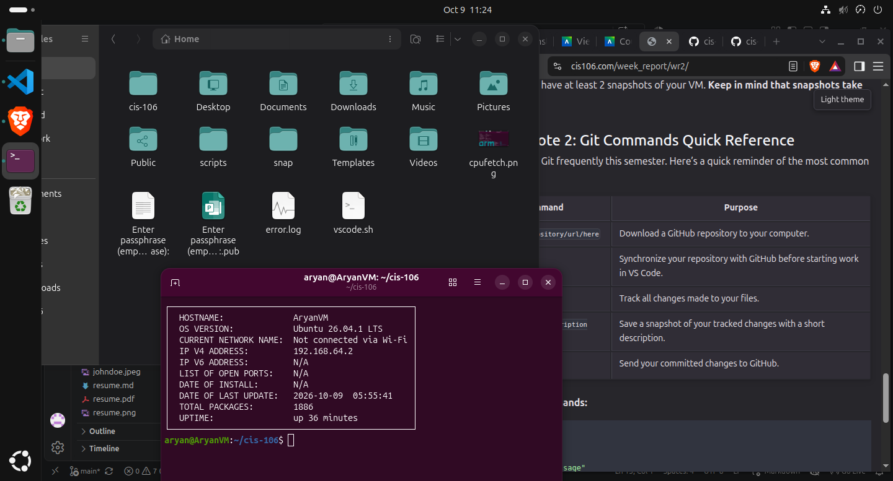

## week report 2 

## alternative 1 using the local files path 

*[Notes 2](../../notes/notes2/notes.md)
*[lab 2](../../labs/lab2/lab2.md)

## alternative 2 using the github url 

*[Notes 2](https://github.com/aryanmaheshwaria2005-lgtm/cis-106/blob/main/labs/Labs2/lab2.md))
*[lab 2](https://github.com/aryanmaheshwaria2005-lgtm/cis-106/blob/main/labs/Labs2/lab2.md)

## debian desktop 
